

# VAE-Burn 🔥

### Implementation of the VAE in Rust 🦀 + [Burn 🔥](https://burn.dev/).

## Dataset 

I collected some images of characters in Detective Conan, then converted them to sketch using [Anime2Sketch](https://github.com/Mukosame/Anime2Sketch)

    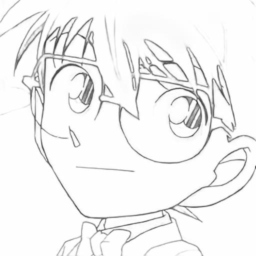
    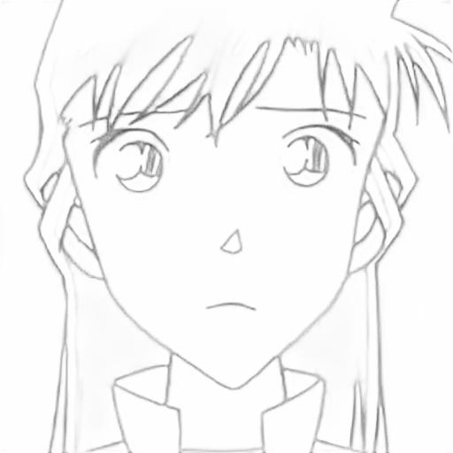
    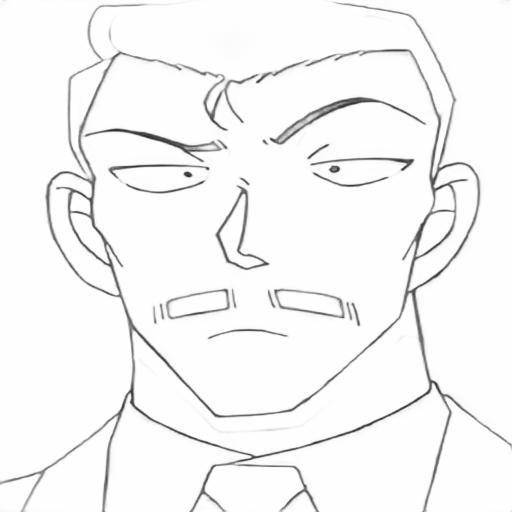
    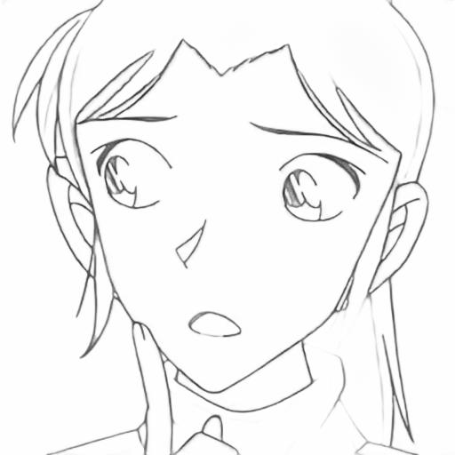
    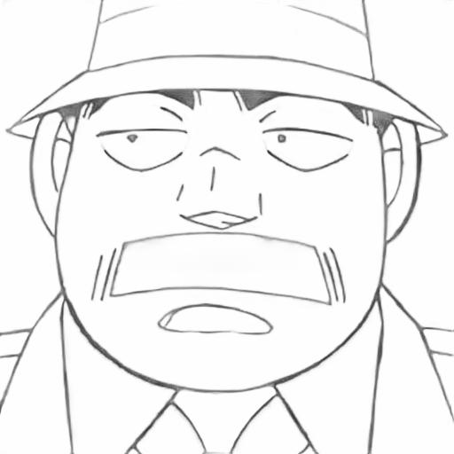

Please note that the customized dataset will not be made public due to copyright issues, this repo only works with MNIST dataset. 

## Results 

Target and reconstruction 

    
    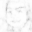

Sampling results 

    
    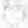

As a comparison, here are some results from a VAE implemented in pytorch 

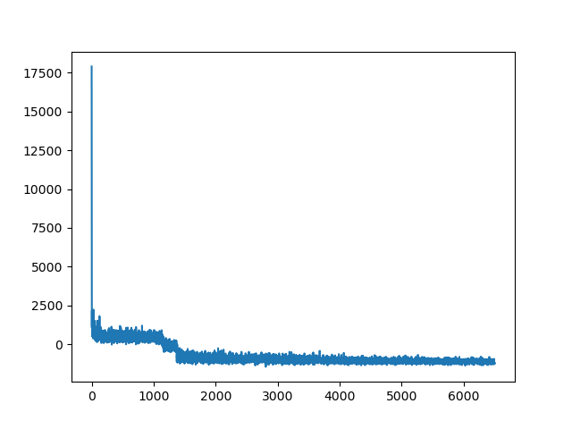

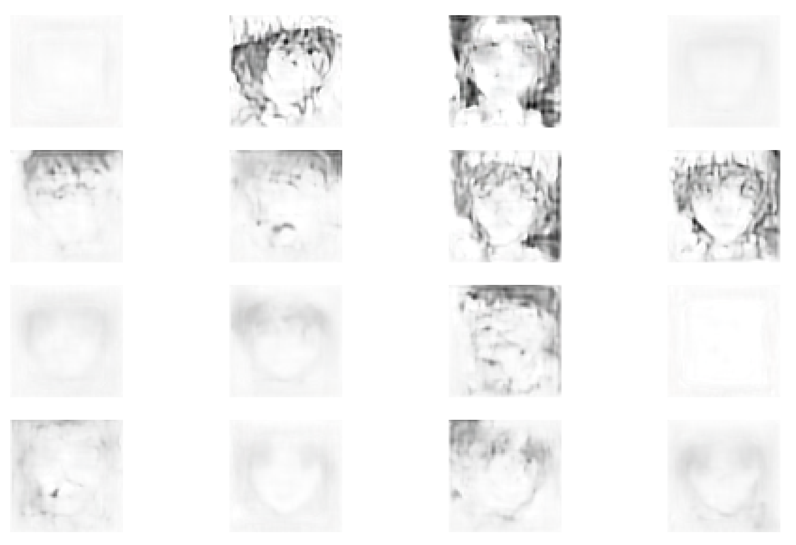

Sketch to image results from [windy AI](https://windybot.com/sketch-to-image-ai)

    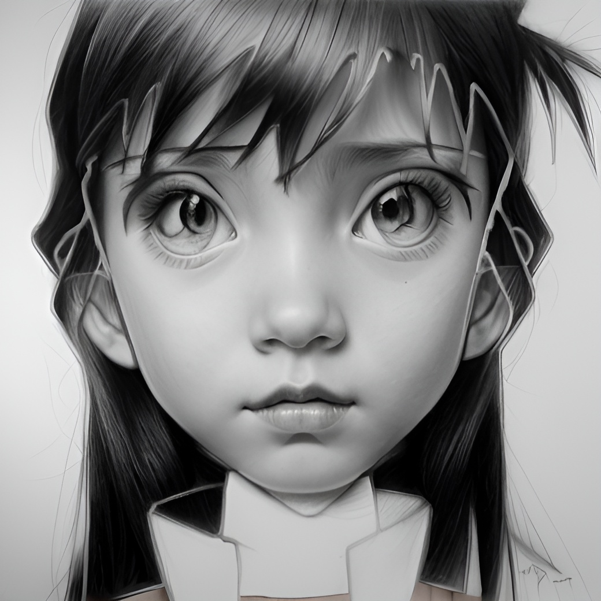
    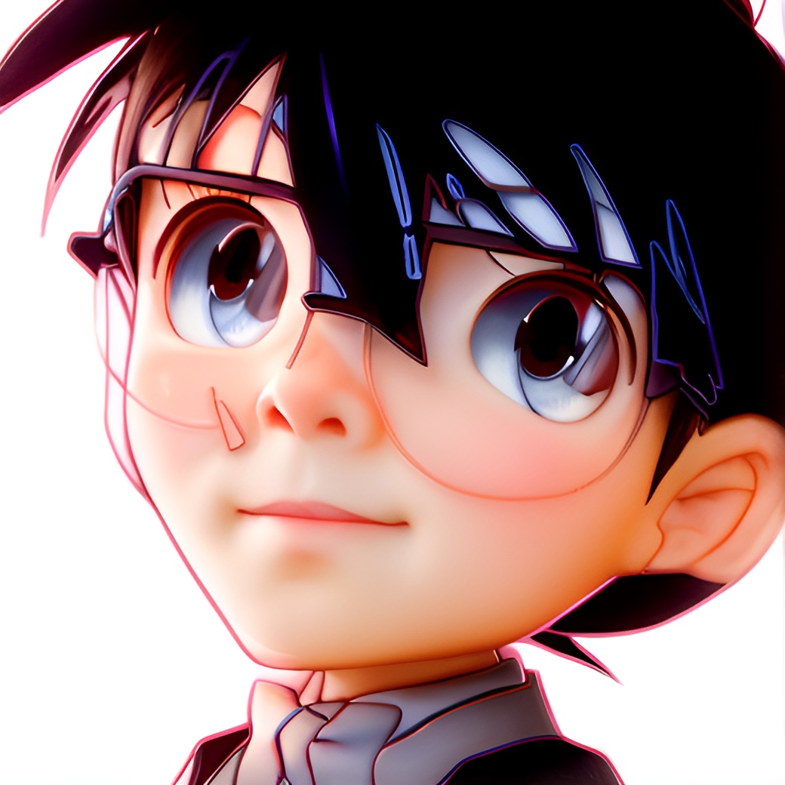
    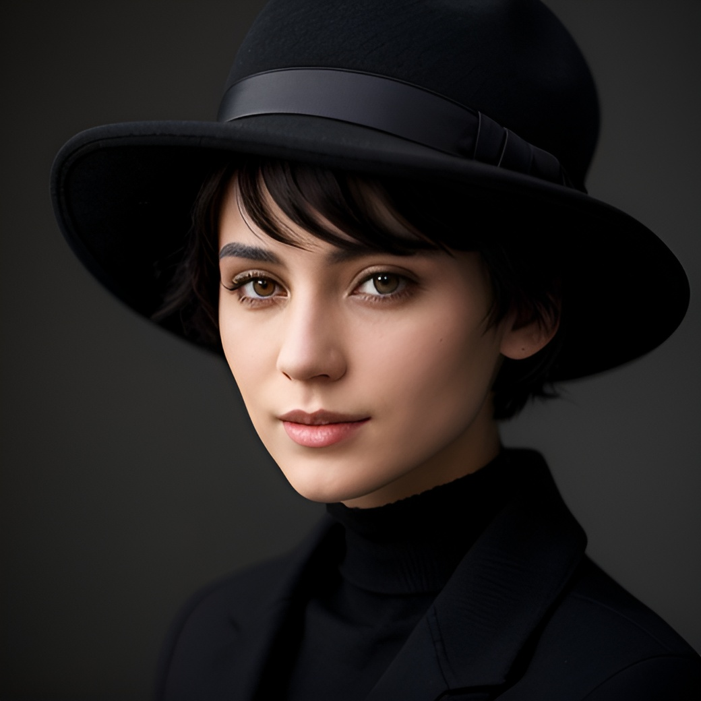

